# PseudoCode

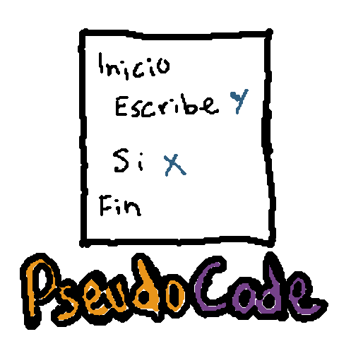

> Editor educativo para escribir, ejecutar y aprender pseudocodigo en español.

PseudoCode es una app de escritorio para practicar logica de programacion con pseudocodigo en español. Esta pensada para estudiantes, profesores y personas que quieren probar algoritmos sin configurar un lenguaje de programacion completo.

El dialecto principal sigue el estilo de **PSeInt**, con editor moderno, multiples archivos, diagnosticos, salida, variables, ayuda integrada y configuracion por JSON.

## Descargas rapidas

- [Descargar ultima version](https://github.com/KityDeveloper/PseudoCode/releases/latest)
- [Ver todos los releases](https://github.com/KityDeveloper/PseudoCode/releases)
- [Notas de version](CHANGELOG.md)
- [Documentacion](docs/ayuda.md)

## Capturas

Estas imagenes vienen de `docs/assets/screenshots`.

### Vista general

Editor principal con pestañas, explorador, panel de ayuda y area de salida.

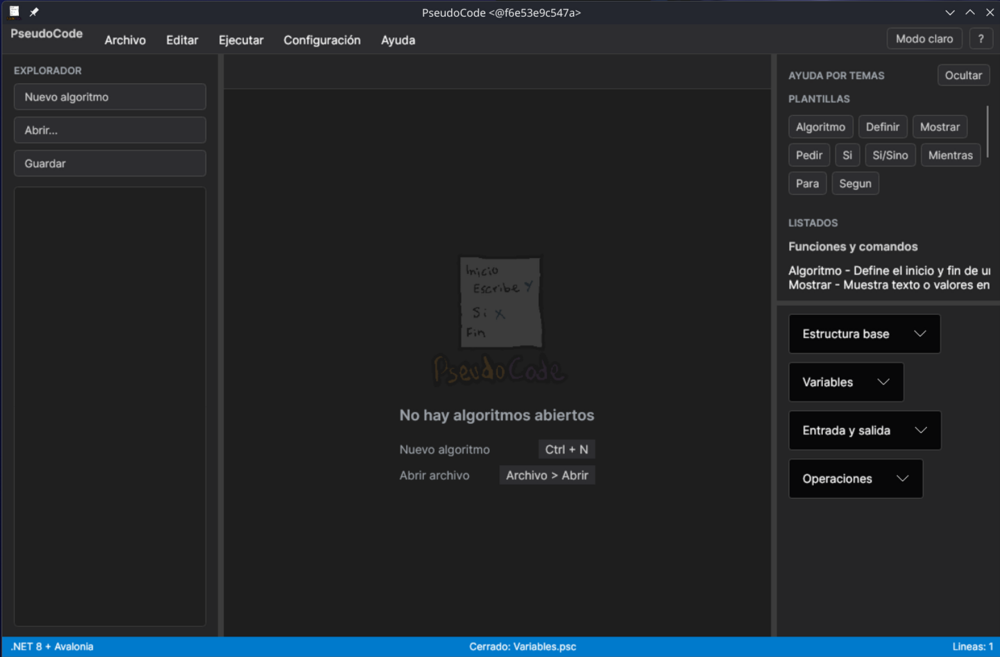

### Editor principal

Espacio de trabajo para escribir pseudocodigo, abrir varios archivos y ver ayuda contextual.

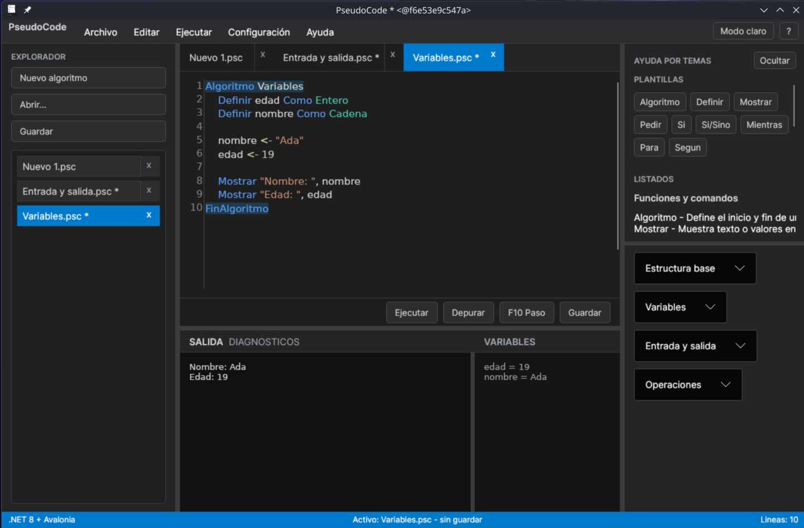

### Depuracion paso a paso

Ejecucion controlada con avance por linea usando `F10`, resaltado del paso actual e inspeccion de variables.

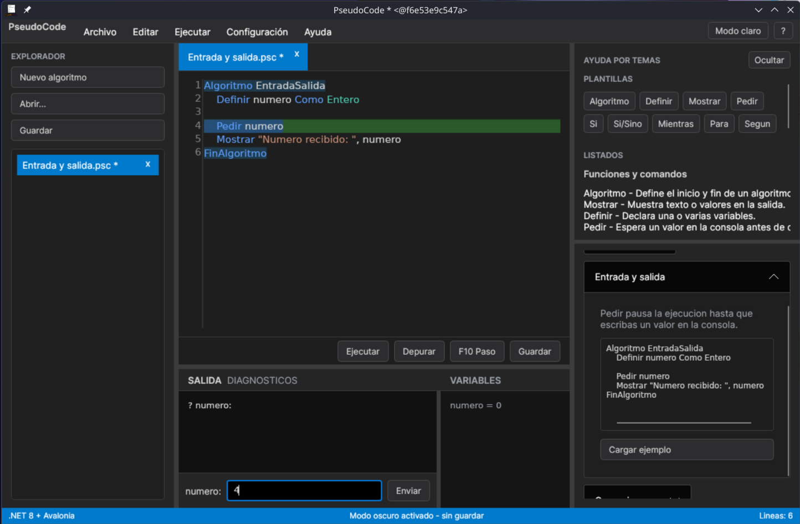

### Modo claro

Tema claro para trabajar con fondos mas luminosos sin perder resaltado de sintaxis.

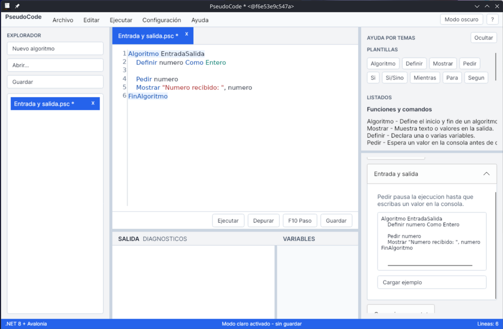

### Configuracion JSON

Ayuda integrada para entender dialectos, settings y temas de sintaxis configurables.

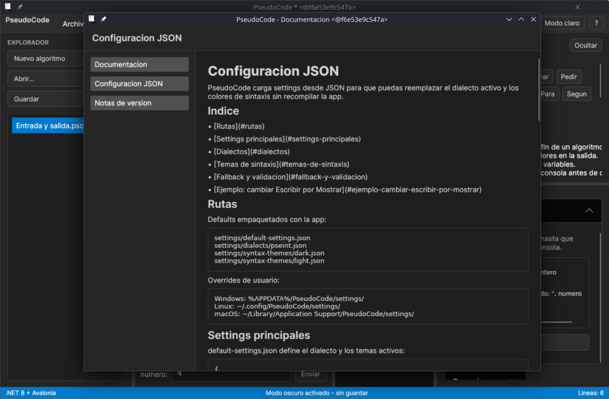

### Documentacion integrada

Documentos Markdown renderizados dentro de la app desde el menu de ayuda.

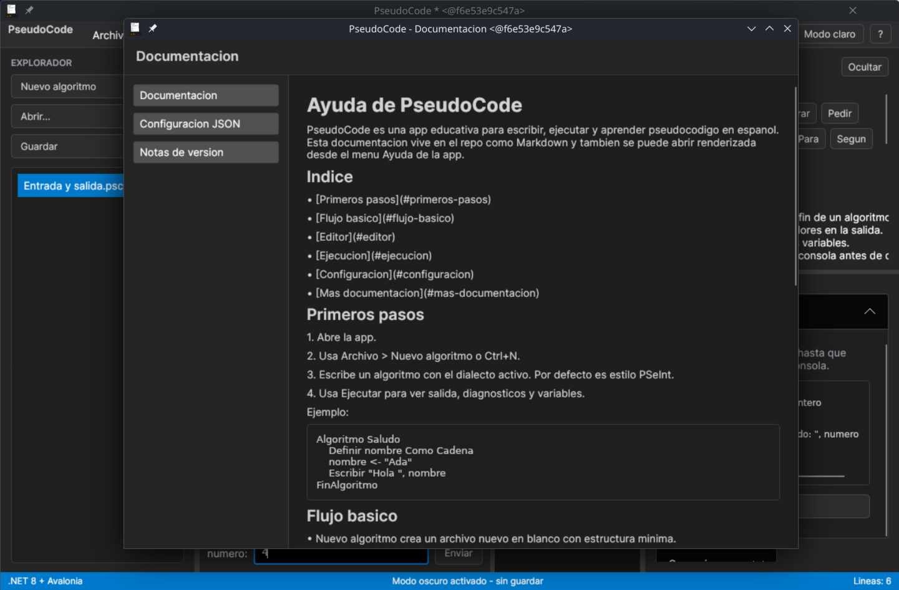

### Menu Archivo

Accesos para crear, abrir, guardar y cerrar algoritmos.

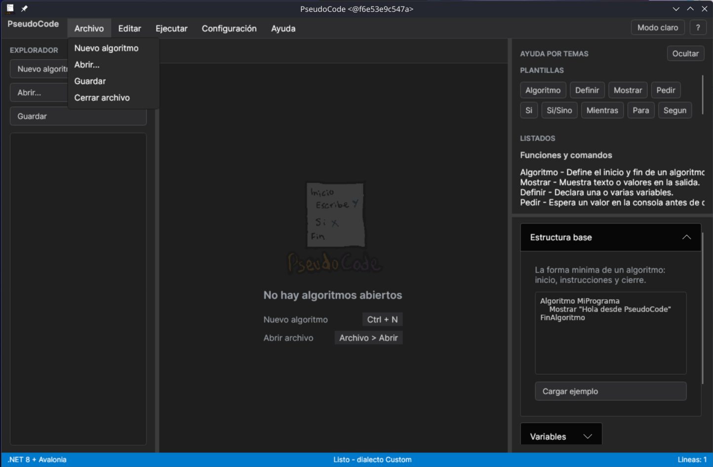

### Menu Editar

Comandos de edicion y acciones rapidas para trabajar con el codigo.

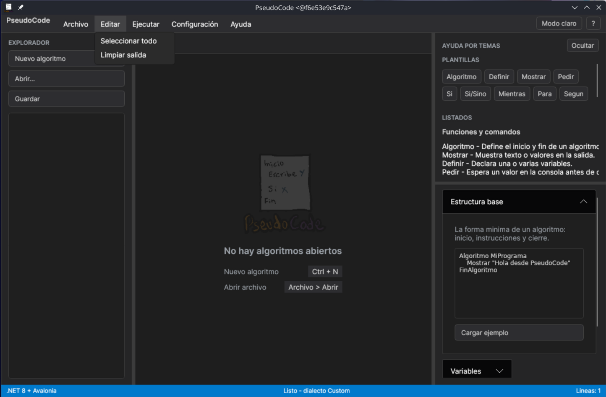

### Menu Ejecutar

Opciones para ejecutar, depurar y controlar el flujo del algoritmo.

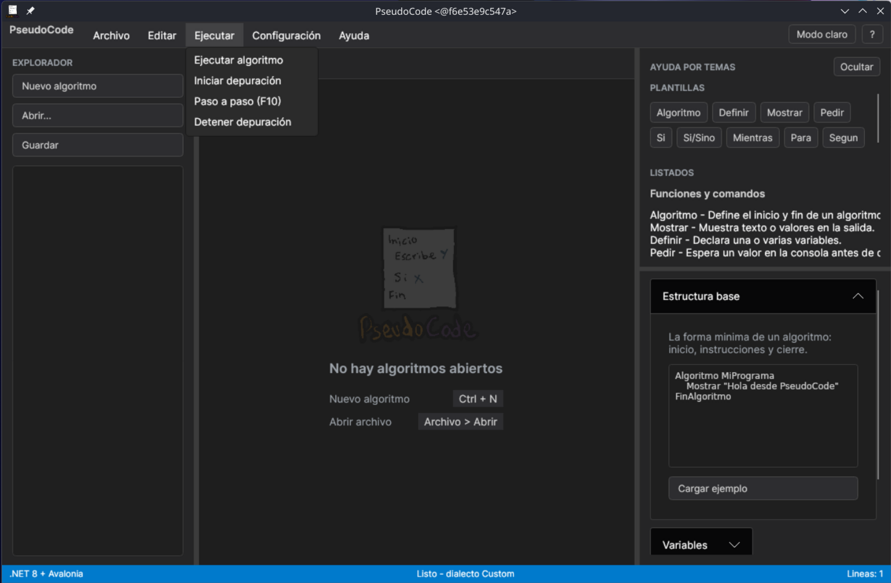

### Menu Configuracion

Entrada para editar settings, temas de codigo fuente y dialectos directamente como JSON.

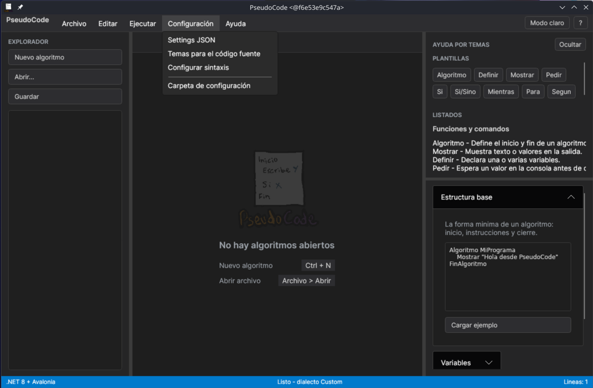

### Menu Ayuda

Acceso a documentacion, notas de version, configuracion JSON y datos de la app.

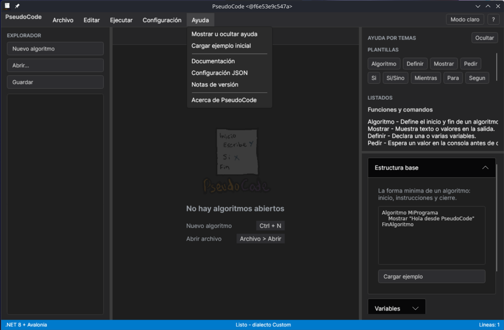

### Acerca de

Ventana con version, logo de la app, datos del autor y enlaces oficiales.

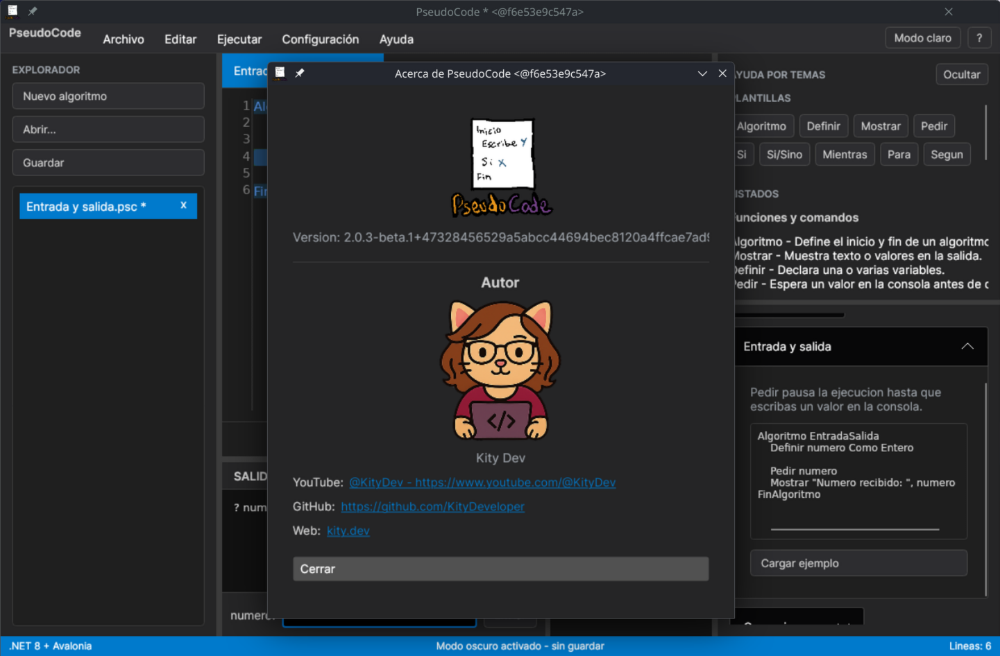

## Indice

- [Para que sirve](#para-que-sirve)
- [Funciones principales](#funciones-principales)
- [Descargas](#descargas)
- [Configuracion JSON](#configuracion-json)
- [Documentacion](#documentacion)
- [Estado del proyecto](#estado-del-proyecto)
- [Autor](#autor)

## Para que sirve

PseudoCode ayuda a escribir y ejecutar ejercicios de pseudocodigo mientras se aprende programacion. Puede usarse para:

- Practicar estructuras como `Si`, `Mientras`, `Para` y `Segun`.
- Ver salida y variables mientras se ejecuta un algoritmo.
- Preparar ejemplos para clase.
- Probar ejercicios sin instalar compiladores grandes.
- Experimentar con dialectos de pseudocodigo configurables.

## Funciones principales

- Editor de pseudocodigo en español.
- Dialecto principal estilo PSeInt.
- Ejecucion de algoritmos con salida y variables.
- Depuracion paso a paso con `F10`.
- Diagnosticos y errores subrayados en rojo.
- Tabs con multiples archivos.
- Paneles redimensionables.
- Lista de archivos abiertos.
- Ayuda rapida integrada.
- Documentacion Markdown renderizada dentro de la app.
- Dialectos JSON reemplazables.
- Colores de sintaxis configurables.
- Menu **Configuracion** para editar settings, temas y dialectos como JSON.
- Modo claro y modo oscuro.

## Descargas

Los paquetes se publican en [GitHub Releases](https://github.com/KityDeveloper/PseudoCode/releases).

| Plataforma | Paquete | Uso |
| --- | --- | --- |
| Windows | `.zip` | Portable |
| Linux | `.tar.gz` | Portable |
| Debian/Ubuntu | `.deb` | Instalacion con `apt` |
| Fedora/Bazzite | `.rpm` | Instalacion con `dnf` o rpm-ostree |
| macOS | Planeado | Pendiente |

> Nota: algunos builds beta pueden no estar firmados todavia. En Windows o macOS puede aparecer una advertencia del sistema operativo.

## Configuracion JSON

PseudoCode puede reemplazar el lenguaje activo mediante JSON. No usa aliases dentro del mismo dialecto: si cambias `Escribir` por `Mostrar`, entonces `Escribir` deja de ser valido en ese dialecto.

Tambien puedes cambiar los colores de sintaxis del editor con JSON. El tema principal por defecto es `dark`.

Lee la guia completa en [Configuracion JSON](docs/configuracion-json.md).

## Documentacion

- [Ayuda general](docs/ayuda.md)
- [Configuracion JSON](docs/configuracion-json.md)
- [Pseudolenguaje](docs/pseudolenguaje.md)
- [Desarrollo](docs/desarrollo.md)
- [Publicacion](docs/publicacion.md)
- [Notas de version](CHANGELOG.md)

La app tambien puede abrir estos documentos desde el menu **Ayuda**.

## Estado del proyecto

Version actual: **2.0.3-beta.1**

PseudoCode esta en beta. La base ya permite editar, abrir varios archivos, ejecutar pseudocodigo y configurar dialectos/colores, pero todavia hay trabajo planeado para depuracion paso a paso, tabla de prueba de escritorio y empaquetado mas pulido.

## Autor

Creado por **Kity Dev**.

- YouTube: [@KityDev](https://www.youtube.com/@KityDev)
- GitHub: [KityDeveloper](https://github.com/KityDeveloper)
- Web: [kity.dev](https://kity.dev)

## Licencia

Consulta la licencia del repositorio. Si agregas una licencia nueva, enlazala aqui.
